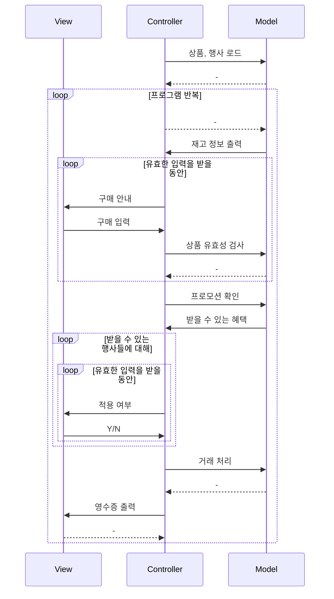

# java-convenience-store-precourse

> 땅떵이가 서울보다 큰 봉화에는 편의점이 5개 정도라는 봉서운 이야기...

<details>
	<summary>과제 세부 내용</summary>

## 과제 내용
구매자의 할인 혜택과 재고 상황을 고려하여 최종 결제 금액을 계산하고 안내하는 결제 시스템을 구현한다.
```
- 로또 번호의 숫자 범위는 1~45까지이다.
- 1개의 로또를 발행할 때 중복되지 않는 6개의 숫자를 뽑는다.
- 당첨 번호 추첨 시 중복되지 않는 숫자 6개와 보너스 번호 1개를 뽑는다.
- 당첨은 1등부터 5등까지 있다. 당첨 기준과 금액은 아래와 같다.
    - 1등: 6개 번호 일치 / 2,000,000,000원
    - 2등: 5개 번호 + 보너스 번호 일치 / 30,000,000원
    - 3등: 5개 번호 일치 / 1,500,000원
    - 4등: 4개 번호 일치 / 50,000원
    - 5등: 3개 번호 일치 / 5,000원
```
- 사용자가 입력한 상품의 가격과 수량을 기반으로 최종 결제 금액을 계산한다.
    - 총구매액은 상품별 가격과 수량을 곱하여 계산하며, 프로모션 및 멤버십 할인 정책을 반영하여 최종 결제 금액을 산출한다.
- 구매 내역과 산출한 금액 정보를 영수증으로 출력한다.
- 영수증 출력 후 추가 구매를 진행할지 또는 종료할지를 선택할 수 있다.
- 사용자가 잘못된 값을 입력할 경우 `IllegalArgumentException`를 발생시키고, "[ERROR]"로 시작하는 에러 메시지를 출력 후 그 부분부터 입력을 다시 받는다.
    - `Exception`이 아닌 `IllegalArgumentException`, `IllegalStateException` 등과 같은 명확한 유형을 처리한다.

### 재고 관리

- 각 상품의 재고 수량을 고려하여 결제 가능 여부를 확인한다.
- 고객이 상품을 구매할 때마다, 결제된 수량만큼 해당 상품의 재고에서 차감하여 수량을 관리한다.
- 재고를 차감함으로써 시스템은 최신 재고 상태를 유지하며, 다음 고객이 구매할 때 정확한 재고 정보를 제공한다.

### 프로모션 할인

- 오늘 날짜가 프로모션 기간 내에 포함된 경우에만 할인을 적용한다.
- 프로모션은 N개 구매 시 1개 무료 증정(Buy N Get 1 Free)의 형태로 진행된다.
- 1+1 또는 2+1 프로모션이 각각 지정된 상품에 적용되며, 동일 상품에 여러 프로모션이 적용되지 않는다.
- 프로모션 혜택은 프로모션 재고 내에서만 적용할 수 있다.
- 프로모션 기간 중이라면 프로모션 재고를 우선적으로 차감하며, 프로모션 재고가 부족할 경우에는 일반 재고를 사용한다.
- 프로모션 적용이 가능한 상품에 대해 고객이 해당 수량보다 적게 가져온 경우, 필요한 수량을 추가로 가져오면 혜택을 받을 수 있음을 안내한다.
- 프로모션 재고가 부족하여 일부 수량을 프로모션 혜택 없이 결제해야 하는 경우, 일부 수량에 대해 정가로 결제하게 됨을 안내한다.

### 멤버십 할인

- 멤버십 회원은 프로모션 미적용 금액의 30%를 할인받는다.
- 프로모션 적용 후 남은 금액에 대해 멤버십 할인을 적용한다.
- 멤버십 할인의 최대 한도는 8,000원이다.

### 영수증 출력

- 영수증은 고객의 구매 내역과 할인을 요약하여 출력한다.
- 영수증 항목은 아래와 같다.
    - 구매 상품 내역: 구매한 상품명, 수량, 가격
    - 증정 상품 내역: 프로모션에 따라 무료로 제공된 증정 상품의 목록
    - 금액 정보
        - 총구매액: 구매한 상품의 총 수량과 총 금액
        - 행사할인: 프로모션에 의해 할인된 금액
        - 멤버십할인: 멤버십에 의해 추가로 할인된 금액
        - 내실돈: 최종 결제 금액
- 영수증의 구성 요소를 보기 좋게 정렬하여 고객이 쉽게 금액과 수량을 확인할 수 있게 한다.

### 입출력
- 입력 1
    - 내용 : 구매할 상품과 수량
    - 형식 : 상품([]), 수량(-), 열거(,)
    - ex) [콜라-10],[사이다-3]
- 입력 2
    - 내용 : 프로모션 상품 추가 여부, 정가 결제 여부, 멤버십 할인 적용 여부, 추가 구매 여부
    - 형식 : Y / N
- 에러 메시지
    - [ERROR]로 시작해야함
    - ex) `[ERROR] 로또 번호는 1부터 45 사이의 숫자여야 합니다.`

ex)

```
안녕하세요. W편의점입니다.
현재 보유하고 있는 상품입니다.

- 콜라 1,000원 10개 탄산2+1
- 콜라 1,000원 10개
- 사이다 1,000원 8개 탄산2+1
- 사이다 1,000원 7개
- 오렌지주스 1,800원 9개 MD추천상품
- 오렌지주스 1,800원 재고 없음
- 탄산수 1,200원 5개 탄산2+1
- 탄산수 1,200원 재고 없음
- 물 500원 10개
- 비타민워터 1,500원 6개
- 감자칩 1,500원 5개 반짝할인
- 감자칩 1,500원 5개
- 초코바 1,200원 5개 MD추천상품
- 초코바 1,200원 5개
- 에너지바 2,000원 5개
- 정식도시락 6,400원 8개
- 컵라면 1,700원 1개 MD추천상품
- 컵라면 1,700원 10개

구매하실 상품명과 수량을 입력해 주세요. (예: [사이다-2],[감자칩-1])
[콜라-3],[에너지바-5]

멤버십 할인을 받으시겠습니까? (Y/N)
Y

===========W 편의점=============
상품명 수량 금액
콜라 3 3,000
에너지바 5 10,000
===========증 정=============
콜라 1
==============================
총구매액 8 13,000
행사할인 -1,000
멤버십할인 -3,000
내실돈 9,000

감사합니다. 구매하고 싶은 다른 상품이 있나요? (Y/N)
Y

안녕하세요. W편의점입니다.
현재 보유하고 있는 상품입니다.

- 콜라 1,000원 7개 탄산2+1
- 콜라 1,000원 10개
- 사이다 1,000원 8개 탄산2+1
- 사이다 1,000원 7개
- 오렌지주스 1,800원 9개 MD추천상품
- 오렌지주스 1,800원 재고 없음
- 탄산수 1,200원 5개 탄산2+1
- 탄산수 1,200원 재고 없음
- 물 500원 10개
- 비타민워터 1,500원 6개
- 감자칩 1,500원 5개 반짝할인
- 감자칩 1,500원 5개
- 초코바 1,200원 5개 MD추천상품
- 초코바 1,200원 5개
- 에너지바 2,000원 재고 없음
- 정식도시락 6,400원 8개
- 컵라면 1,700원 1개 MD추천상품
- 컵라면 1,700원 10개

구매하실 상품명과 수량을 입력해 주세요. (예: [사이다-2],[감자칩-1])
[콜라-10]

현재 콜라 4개는 프로모션 할인이 적용되지 않습니다. 그래도 구매하시겠습니까? (Y/N)
Y

멤버십 할인을 받으시겠습니까? (Y/N)
N

===========W 편의점=============
상품명 수량 금액
콜라 10 10,000
===========증 정=============
콜라 2
==============================
총구매액 10 10,000
행사할인 -2,000
멤버십할인 -0
내실돈 8,000

감사합니다. 구매하고 싶은 다른 상품이 있나요? (Y/N)
Y

안녕하세요. W편의점입니다.
현재 보유하고 있는 상품입니다.

- 콜라 1,000원 재고 없음 탄산2+1
- 콜라 1,000원 7개
- 사이다 1,000원 8개 탄산2+1
- 사이다 1,000원 7개
- 오렌지주스 1,800원 9개 MD추천상품
- 오렌지주스 1,800원 재고 없음
- 탄산수 1,200원 5개 탄산2+1
- 탄산수 1,200원 재고 없음
- 물 500원 10개
- 비타민워터 1,500원 6개
- 감자칩 1,500원 5개 반짝할인
- 감자칩 1,500원 5개
- 초코바 1,200원 5개 MD추천상품
- 초코바 1,200원 5개
- 에너지바 2,000원 재고 없음
- 정식도시락 6,400원 8개
- 컵라면 1,700원 1개 MD추천상품
- 컵라면 1,700원 10개

구매하실 상품명과 수량을 입력해 주세요. (예: [사이다-2],[감자칩-1])
[오렌지주스-1]

현재 오렌지주스은(는) 1개를 무료로 더 받을 수 있습니다. 추가하시겠습니까? (Y/N)
Y

멤버십 할인을 받으시겠습니까? (Y/N)
Y

===========W 편의점=============
상품명 수량 금액
오렌지주스 2 3,600
===========증 정=============
오렌지주스 1
==============================
총구매액 2 3,600
행사할인 -1,800
멤버십할인 -0
내실돈 1,800

감사합니다. 구매하고 싶은 다른 상품이 있나요? (Y/N)
N
```

</details>

> 막주차 되니까 구조 짜기가 귀찮네요... 그냥 짜고 볼까...?

## 구현 기능 목록
- 입력
  - 구매할 상품과 수량
  - Y/N 응답
- 출력
  - 안내 문구
  - 판매 상품
  - 영수증
- 재고 관리
- 할인 관리

## 코드 흐름


## 처리할 예외
- 형식에 맞지 않는 상품
- 존재하지 않는 상품
- 유효하지 않은 구매 (수량 초과 등)
- Y/N이 아닌 다른 입력